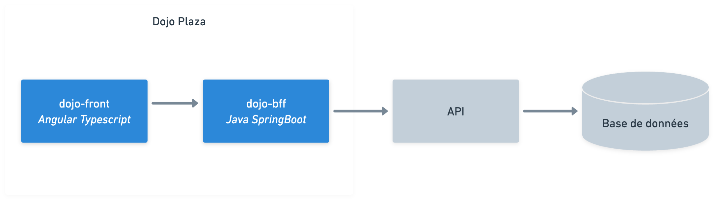

# Dojo Plaza

L’objectif de ce dojo est de vous immerger dans la vie d’un Sipionaute au travers d’un jeu d’investissement immobilier.
Vous allez commencer avec un capital de départ et un appartement dans lequel vous vivez ! Votre mission ? Réussir à se
créer un patrimoine immobilier et obtenir le plus gros capital possible. Pour ça, vous suivrez des étapes permettant de
déboguer votre site pour débloquer des fonctionnalités ou même en développer de nouvelles de bout en bout.

## Cela se déroulera en 4 étapes :

- Votre solde n’évolue pas ? Essayons de comprendre pourquoi...
    - L'affichage du solde semble bloqué ! Est-ce un problème front ? Back ? Ou les deux peut-être ...
- Devenez propriétaire de votre premier bien et arrêtez de vivre dans une location !
    - Mais pour ça encore faudrait-il avoir accès aux autres pages !
    - Vous pouvez acheter des biens participatifs ? C'est bien, mais acheter un appartement, c'est mieux ! Comment ça
      votre liste ne vous montre que les plus chers ?
- Commencez à acheter vos premiers appartements.
    - Au vu des prix des appartements, il serait peut-être bon de vendre vos premières acquisitions ! Je vous conseille
      de regarder un peu plus bas...
- Vous ne percevez plus de loyers... Oups, nous avons peut-être omis une information !
    - Un utilisateur nous a prévenus que les loyers stagnaient au bout d'un moment. Il nous parlait de "passoire
      énergétique". Il faudrait peut-être investiguer dans cette direction.

## Méthodologie

L’une des valeurs de Sipios est le pragmatisme. Cela se voit tout au long de nos journées et passe par des gestes
simples comme le Andon. Ce mot japonais signifie “lanterne” et cela veut dire que chez nous toutes les personnes, peu
importe leur poste, posent des questions aux autres pour se débloquer de situation ou demander de l’aide. Et cela va
dans les deux sens, même Thibault, l’EM ici présent, Andon des développeurs pour l’aider à avancer. Donc si vous vous
sentez bloqué ou que vous avez une question, interpellez nous !

# Setup

Ouvrir un nouveau codespace puis : 

Démarrer le back
- Ouvrir un nouveau terminal
- Rendez vous à la source du projet back `cd dojo-bff/dojo-bff`
- Lancer la commandes `sdk install java`
- Lorsque l’on vous demande si vous voulez utiliser java 17 en tant que version par défaut : répondre « oui ».
- Lancer le projet avec `mvn spring-boot:run`

Démarrer le front
- Ouvrir un nouveau terminal
- Rendez vous à la source du projet front `cd dojo-front/dojo-front`
- Lancer la commande `npm install`
- Lancer le frontend avec  `npm run start`

# Schéma d'archi

# Aide

{"openapi":"3.0.0","paths":{"/":{"get":{"operationId":"AppController_getHello","parameters":[],"responses":{"200":{"description":"Get API health"}},"tags":["Health"]}},"/users/me":{"get":{"operationId":"UsersController_getProfile","parameters":[],"responses":{"200":{"description":"Return logged user","content":{"application/json":{"schema":{"$ref":"#/components/schemas/User"}}}}},"tags":["Users"]}},"/users/amount":{"get":{"operationId":"UsersController_getUserAmount","parameters":[],"responses":{"200":{"description":"Get user amount","content":{"application/json":{"schema":{"$ref":"#/components/schemas/UserAmountDto"}}}}},"tags":["Users"]}},"/users/realties":{"get":{"operationId":"UsersController_getUserRealties","parameters":[],"responses":{"200":{"description":"Get user realties","content":{"application/json":{"schema":{"type":"array","items":{"$ref":"#/components/schemas/Realty"}}}}}},"tags":["Users"]}},"/realties":{"get":{"operationId":"RealtiesController_getAllRealties","parameters":[{"name":"sort","required":false,"in":"query","schema":{"type":"string"}},{"name":"type","required":false,"in":"query","schema":{"type":"string"}}],"responses":{"200":{"description":"Find matching realties","content":{"application/json":{"schema":{"type":"array","items":{"$ref":"#/components/schemas/Realty"}}}}}},"tags":["Realties"]}},"/realties/buy":{"post":{"operationId":"RealtiesController_buyRealty","parameters":[],"requestBody":{"required":true,"content":{"application/json":{"schema":{"$ref":"#/components/schemas/BuyRealtyDto"}}}},"responses":{"204":{"description":"Buy a realty","content":{"application/json":{"schema":{"$ref":"#/components/schemas/Realty"}}}}},"tags":["Realties"]}},"/realties/sell":{"post":{"operationId":"RealtiesController_sellRealty","parameters":[],"requestBody":{"required":true,"content":{"application/json":{"schema":{"$ref":"#/components/schemas/BuyRealtyDto"}}}},"responses":{"200":{"description":"Sell a realty"}},"tags":["Realties"]}},"/realties/renovate":{"post":{"operationId":"RealtiesController_renovateRealty","parameters":[],"requestBody":{"required":true,"content":{"application/json":{"schema":{"$ref":"#/components/schemas/RenovateRealtyDto"}}}},"responses":{"204":{"description":"Renovate a realty","content":{"application/json":{"schema":{"$ref":"#/components/schemas/Realty"}}}}},"tags":["Realties"]}},"/assets":{"get":{"operationId":"AssetsController_findAll","parameters":[],"responses":{"200":{"description":"Get all user assets","content":{"application/json":{"schema":{"type":"array","items":{"$ref":"#/components/schemas/IntersectionUserAssetPickTypeClass"}}}}}},"tags":["Assets"]}},"/transactions":{"get":{"operationId":"TransactionsController_findAll","parameters":[],"responses":{"200":{"description":"Get all user transactions","content":{"application/json":{"schema":{"type":"array","items":{"$ref":"#/components/schemas/IntersectionTransactionPickTypeClass"}}}}}},"tags":["Transactions"]}},"/auth/login":{"post":{"operationId":"AuthController_signIn","parameters":[],"requestBody":{"required":true,"content":{"application/json":{"schema":{"$ref":"#/components/schemas/SignInDto"}}}},"responses":{"200":{"description":""}},"tags":["Auth"]}}},"info":{"title":"Realty API","description":"","version":"1.0","contact":{}},"tags":[],"servers":[],"components":{"schemas":{"User":{"type":"object","properties":{"id":{"type":"number"},"mail":{"type":"string"},"level":{"type":"number"}},"required":["id","mail","level"]},"UserAmountDto":{"type":"object","properties":{"amount":{"type":"number"}},"required":["amount"]},"DeedType":{"type":"string","enum":["APARTMENT","PARTICIPATIVE"]},"Realty":{"type":"object","properties":{"id":{"type":"number"},"amount":{"type":"number"},"rent":{"type":"number"},"label":{"type":"string"},"image":{"type":"string"},"deedType":{"$ref":"#/components/schemas/DeedType"},"scoring":{"type":"number"},"lastScoreUpdate":{"format":"date-time","type":"string"}},"required":["id","amount","rent","deedType","scoring"]},"BuyRealtyDto":{"type":"object","properties":{"realtyId":{"type":"number"}},"required":["realtyId"]},"RenovateRealtyDto":{"type":"object","properties":{"realtyId":{"type":"number"}},"required":["realtyId"]},"AssetType":{"type":"string","enum":["OWNER","TENANT"]},"IntersectionUserAssetPickTypeClass":{"type":"object","properties":{"userId":{"type":"number"},"realtyId":{"type":"number"},"type":{"$ref":"#/components/schemas/AssetType"},"realty":{"$ref":"#/components/schemas/Realty"}},"required":["userId","realtyId","type","realty"]},"IntersectionTransactionPickTypeClass":{"type":"object","properties":{"transactionId":{"type":"number"},"userId":{"type":"number"},"realtyId":{"type":"number"},"amount":{"type":"number"},"createdAt":{"format":"date-time","type":"string"},"realty":{"$ref":"#/components/schemas/Realty"}},"required":["transactionId","userId","amount","createdAt"]},"SignInDto":{"type":"object","properties":{"email":{"type":"string"}},"required":["email"]}}}}
